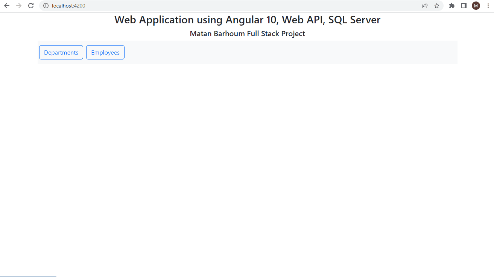
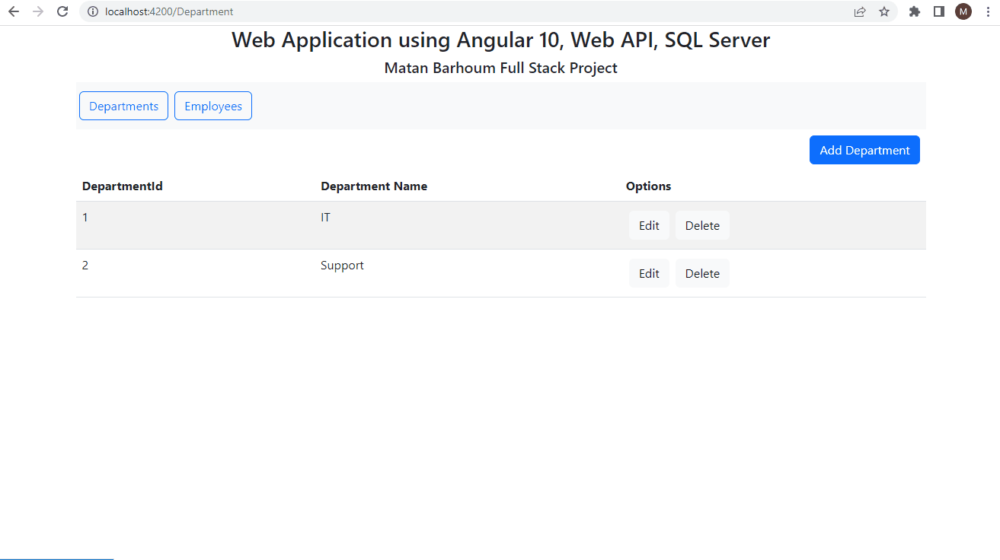

# Employees Management Web Portal (CRUD) FullStack Project

<h2>Front End</h2>
Angular 10

<h2>Back-End</h2>
For the Web API I decided to go with .Net (C#) as I am more familiar with .Net and C#.  
2 Models contain the properties and 2 Controllers do the Server to SQL job. 
CORS has been added, but not used ("*", "*", "*")

<h2>Database</h2>
I decided to go with SQL Server because my company work with SQL Server and after so many years in the section of Private Server Games (Maplestory, Wow, CS 1.6) I decided to abandon the MYSQL for a while :)

<h1>Demonstration</h1>
<h2>Department Section</h2>

<h2>Employee Section</h2>

