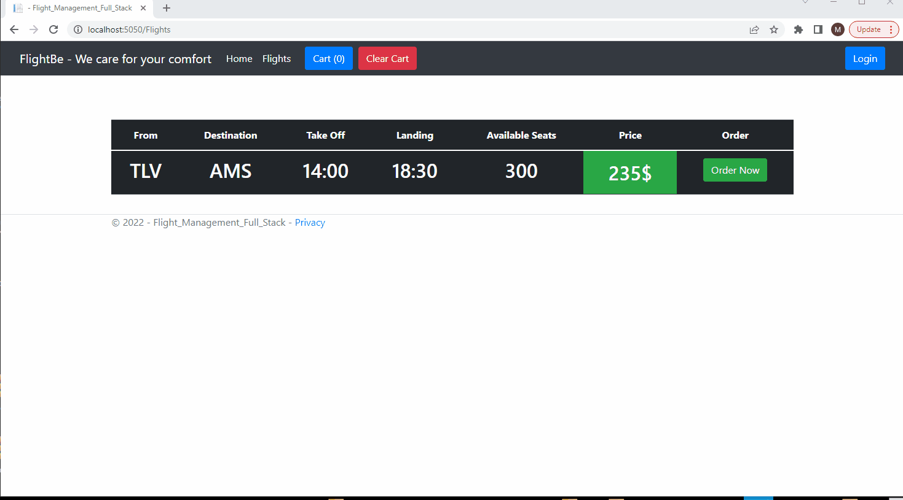
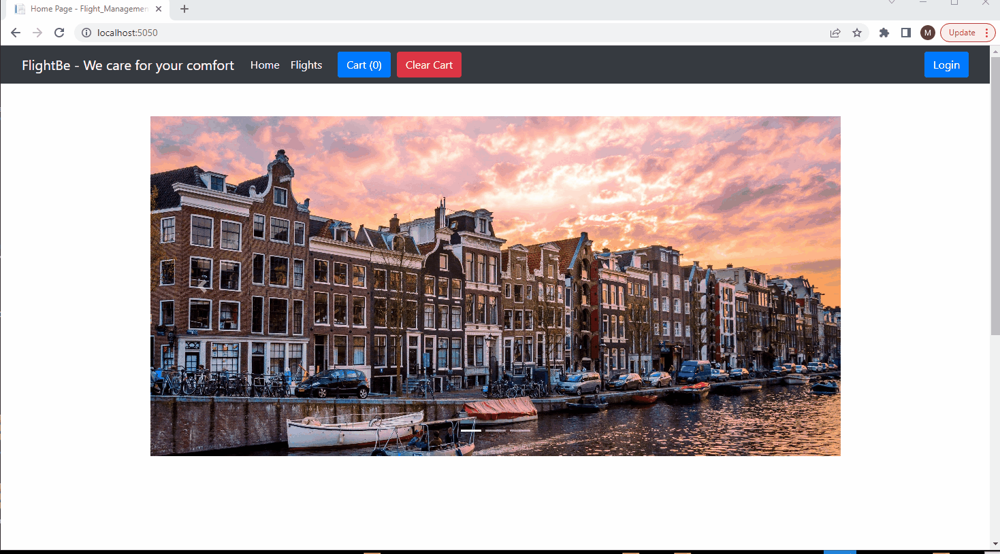

# ASP.NET Core MVC Flight Management + Portal Full Stack Project

Front End: HTML, CSS, Bootstrap, Javascript
Back End: C#
Database: SQL Server 2019

<h3>Demo</h3>

<h3>Order + Cart Demo (Flights Details from DB using flight model (class))</h3>

<h3>Login Demo</h3>
