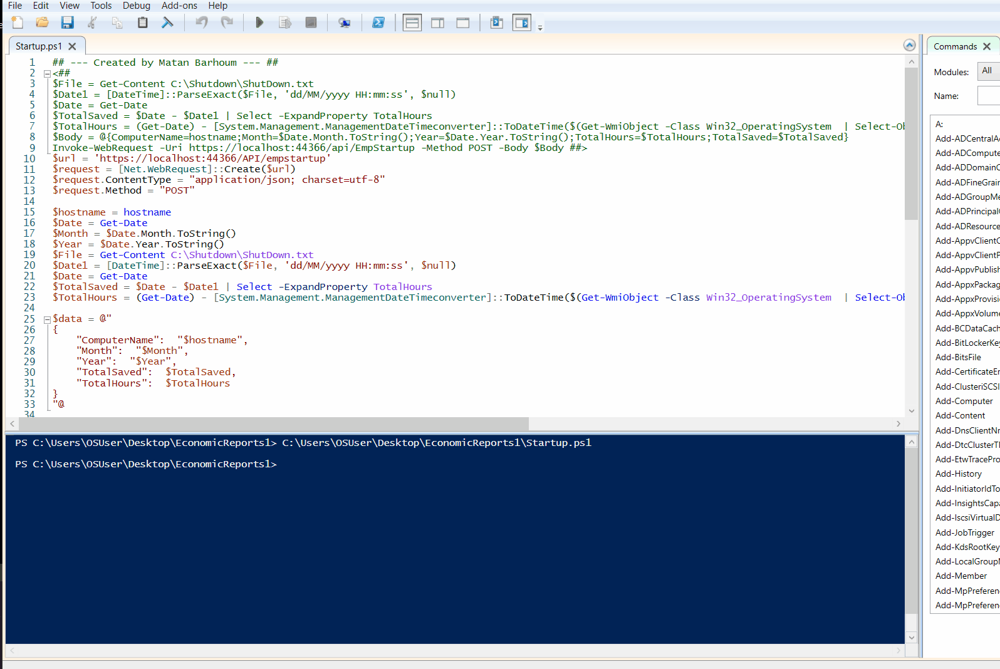
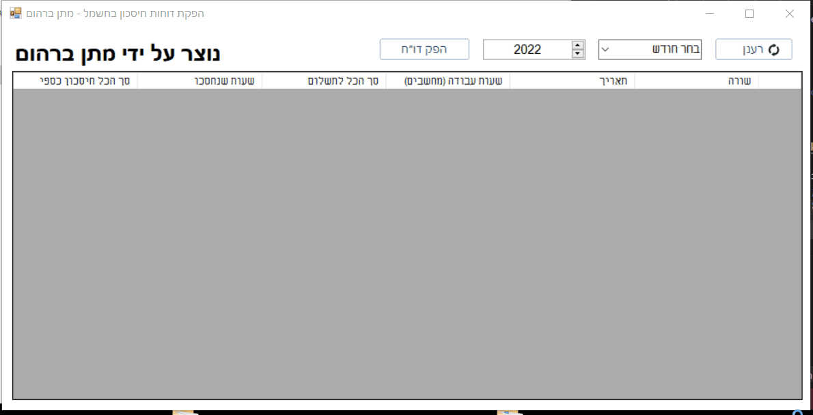
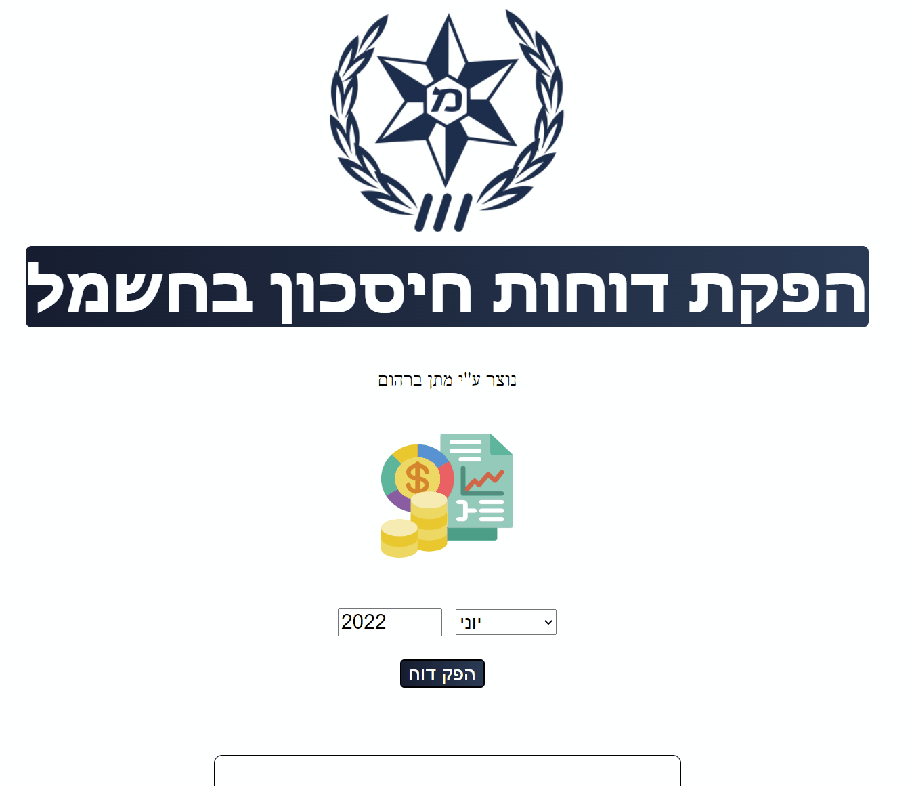

# Shutdown Computers System

<h1>Why I developed this system</h1>
The company I work for was asking for a project to save electricity costs. I came up with the idea of forcing them to shutdown computers everyday at 20:00 (Israel Day Time).  
I created a "Powershell" Win-Forms script that prompt a pop-up that counts down 900 seconds. When the count reach 0, the computer is forced to shut down.  
In this process, a file is created in "C:\Shutdown\Shutdown.txt" with the Date and time in order to compare at startup how long was the computer off and how much electricity been saved.  
With API Post, i send data as JSON format to the EMP and the the server-side (Written in C#) process it into the SQL as shown in the demo's below.  
When the computer is turned on, the Startup Powershell script determine using (Get-Date - ShutDown.txt (get-date from shutdown) and get the totalhours the computer was off.  
Once Again, API Post is used to send data in JSON format to the server-side to send it to SQL.  
Then, I can use the Web Application (Written in HTML, CSS, C#, SQL, Javascript and JQuery) to make a report about how much money was saved based on the data I gather using the scripts.  
Also, the Report App connect to the SQL and can show you in datagridview, with columns and colors (green for saving and red for cost) and the currency icon. This app have the function of summary at the end of the columns, which can calculate as many rows you need.  
This project is not completed and will be further developed and upgraded as my company needed. These upgrades will be updated here as well.  
WebApplication is 1GB size, and has many files. Send me an email to "MatanBarhoum@outlook.com" for the Full Web Applicatino and you will get it.  

I choosed to work with PS1 (powershell scripts) at the client side because I wanted to maintain the client side editable by others at my company who does not know c# and can't maintain this.
<h1>How does it work?</h1>
<h2>Here some demos:</h2>

<h2>API to Server-Side + SQL query showing Data was proccessed into the SQL.</h2>

<h2>Demo of the report app and how it's work.</h2>

<h2>The Web Application as well.</h2>

